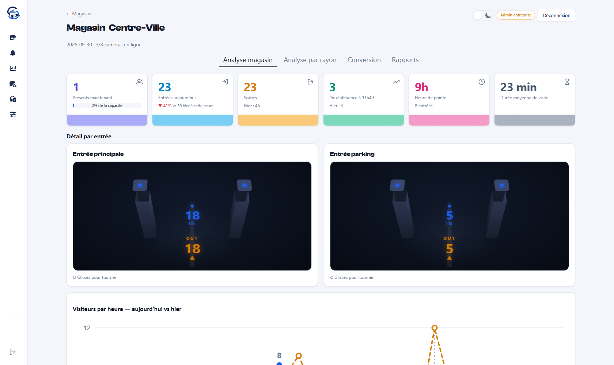
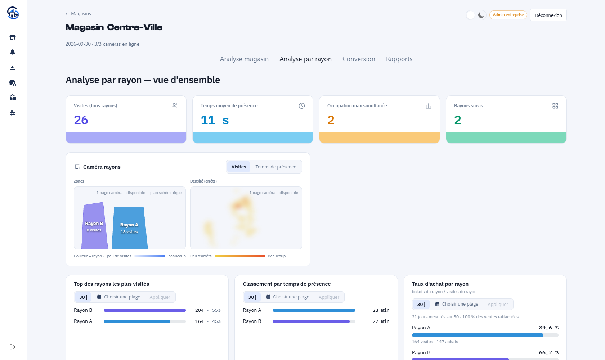
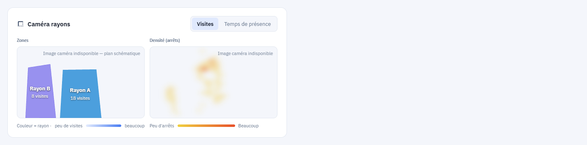
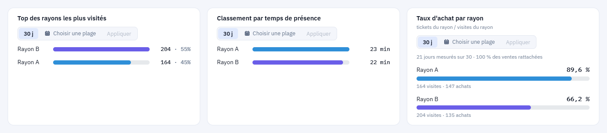
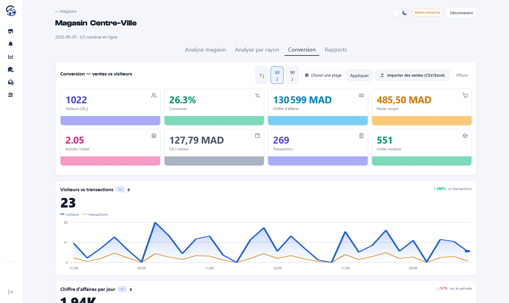
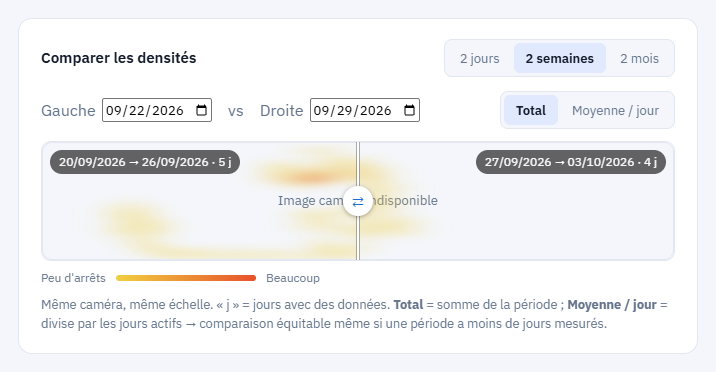

# Captures d'écran

Interface en français, thème clair. Les noms d'enseigne, de magasins et de caméras
ont été remplacés par des noms neutres ; aucune image de caméra ne montre de personne.

## Analyse magasin

Comptage temps réel, comparaison avec la veille à la même heure, détail par entrée.

## Analyse par rayon

Vue d'ensemble d'un magasin : indicateurs de fréquentation des rayons, vues caméra,
classements et taux d'achat.

## Zones et densité

À gauche, les **zones** telles qu'elles sont tracées au sol : des polygones, pas des
rectangles — en perspective, le sol devant un rayon est un trapèze. À droite, la
**carte de densité** des arrêts.

Ici la caméra ne répond pas : l'interface bascule sur le plan schématique plutôt que
d'afficher un cadre vide.

## Croiser fréquentation et ventes

Le **taux d'achat** d'un rayon : tickets contenant au moins un article du rayon ÷
visites du rayon. La carte indique combien de jours ont été réellement mesurés et
quelle part des ventes a pu être rattachée à un rayon.

## Conversion

Visiteurs, taux de conversion, panier moyen, articles par ticket — après import du
CSV de la caisse.

## Comparer deux périodes

Comparaison de deux semaines sur la même caméra et à la même échelle, avec le choix
entre le total et la moyenne par jour — sans quoi une période comptant moins de jours
mesurés paraîtrait moins fréquentée.

